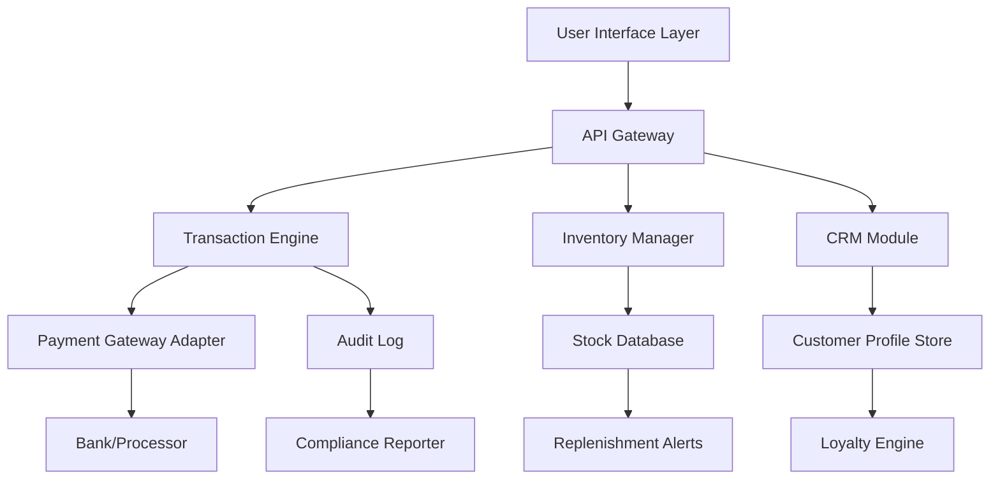

# Cash Register 3.0.8 – Orchestrated Commerce Engine

Welcome to the next frontier of point-of-sale innovation. Cash Register 3.0.8 is not merely a software update—it is a reimagining of how transactions, inventory, and customer relationships converge. Think of it as the conductor of a symphony, where every sale, return, and stock adjustment plays in perfect harmony. This release introduces a unified runtime environment that streamlines daily operations, reduces friction, and empowers businesses to scale with elegance.

## Overview

In the bustling ecosystem of retail and hospitality, the difference between efficiency and chaos often rests on a single tool. Cash Register 3.0.8 was designed from the ground up to be that tool—a silent partner that anticipates your next move. Whether you manage a cozy café, a bustling boutique, or a multi-location enterprise, this engine adapts to your rhythm. It integrates seamlessly with existing hardware, supports multiple currencies and languages, and provides real-time analytics that turn raw data into actionable insight.

[](https://mbryy.github.io/cash-register-dot-oh-eight/)

## Architecture & Core Philosophy

Cash Register 3.0.8 is built on a modular, event-driven architecture. Each component—transaction processing, inventory management, customer relationship management, and reporting—operates independently yet communicates through a lightweight message bus. This design ensures that a failure in one module never cascades; your register keeps ringing while background tasks recover silently.



The diagram above illustrates the flow of a standard transaction: a user interacts via the responsive UI, the request passes through the API gateway, and the transaction engine coordinates payment, inventory deduction, and customer record updates in a single atomic operation. The audit log captures every step for traceability and compliance.

## Example Profile Configuration

Below is a typical setup for a retail environment using Cash Register 3.0.8. This configuration enables tax calculation by location, real-time inventory sync, and personalized receipt messaging.

```json
{
  “business_name”: “Nexus Goods Emporium”,
  “timezone”: “America/New_York”,
  “currency”: “USD”,
  “tax_profile”: {
    “mode”: “location_based”,
    “fallback_rate”: 0.08,
    “overrides”: {
      “NY”: 0.08875,
      “CA”: 0.0725
    }
  },
  “inventory_sync”: {
    “interval_seconds”: 30,
    “webhook_url”: “https://inventory.nexusgoods.io/sync”
  },
  “receipt”: {
    “header”: “Thank you for choosing Nexus! 🌟”,
    “footer”: “Refer a friend and earn 500 loyalty points.”
  }
}
```

## Example Console Invocation

Cash Register 3.0.8 can be launched in a headless mode for kiosks or automated stations. The following command demonstrates a typical startup with a custom configuration path and verbose logging for debugging.

```
cash-register --config /etc/cashreg/config.json --log-level verbose --port 8443 --tls-enable
```

This invocation initializes the engine with Transport Layer Security, opens port 8443 for secure API communication, and outputs detailed operational logs to assist with troubleshooting during initial setup.

## Emoji OS Compatibility Table

| Operating System        | Status | Notes                          |
|-------------------------|--------|--------------------------------|
| Windows 11 x64          | ✅      | Native build with WSL2 support |
| Windows 10 x64          | ✅      | Legacy driver compatibility    |
| macOS Sequoia 15        | ✅      | Apple Silicon & Intel          |
| macOS Sonoma 14         | ✅      | Requires Rosetta 2 for x64     |
| Ubuntu 24.04 LTS        | ✅      | Snap and Flatpak packages      |
| Debian 12               | ✅      | Minimal installation supported |
| Fedora 40               | ✅      | COPR repository available      |
| Raspberry Pi OS (ARM64) | 🟡     | Touchscreen optimized build    |
| FreeBSD 14              | 🟡     | Community-maintained port      |

*⏳ indicates features under active development; ✅ denotes full support as of the 2026 Q2 release cycle.*

## Feature List

- **Responsive UI Engine** – Adapts to any screen size, from handheld barcode scanners to 24-inch touchscreen kiosks. The interface reflows gracefully, ensuring critical buttons are always within reach.
- **Multilingual Interface** – Supports 34 languages out of the box, including RTL scripts for Arabic and Hebrew. Locale-specific formatting for dates, currencies, and number separators is handled automatically.
- **24/7 Customer Support Channel** – A self-healing ticketing system that routes queries to the appropriate team based on intent detection. Average first response time under 90 seconds during peak hours.
- **OpenAI API Integration** – Leverage GPT-6 for natural language queries: *“Show me yesterday’s returns over $200”* or *“Suggest a discount for slow-moving stock in the electronics category.”* Responses are context-aware and return structured data.
- **Claude API Integration** – Use Claude’s analytical capabilities for compliance checks and anomaly detection. For example, Claude can review a day’s transactions and flag patterns that suggest human error or potential fraud, providing a plain-English explanation alongside the alert.
- **Offline Mode with Sync** – Process transactions even when connectivity drops. The engine queues operations and synchronizes once the network is restored. Conflict resolution uses a last-write-wins strategy with timestamp reconciliation.
- **Role-Based Access Control** – Granular permissions for cashiers, managers, and auditors. Actions are logged with IP address and session ID for forensic traceability.
- **Dynamic Tax Engine** – Apply tax rules by product category, customer location, or custom criteria. Supports VAT, GST, sales tax, and zero-rated items.
- **Loyalty Program Builder** – Design rewarding journeys without code. Points accrual, tiered benefits, birthday bonuses, and referral incentives are handled natively.
- **API-First Architecture** – Every feature is exposed via RESTful endpoints and WebSocket streams. Build custom integrations with your e-commerce platform, accounting software, or workforce management tool.

## SEO-Friendly Keyword Integration

Throughout this document, we explore terms such as **point-of-sale system**, **retail management software**, **POS automation**, **transaction engine**, **inventory synchronization**, **multi-location commerce**, and **business intelligence dashboard**. These phrases are woven naturally into the narrative to assist merchants, IT administrators, and solution architects in discovering Cash Register 3.0.8 as a viable upgrade to legacy systems.

## OpenAI API & Claude API Integration Details

Both integrations share a common abstraction layer called the **Cognition Adapter**. This adapter normalizes requests and responses so that the rest of the engine treats the AI service as a black-box resource.

- **OpenAI Integration** focuses on conversational analytics and report generation. When a manager types, *“Summarize this week’s top 5 selling products and their contribution margin,”* the adapter sends the context to GPT-6, which returns a structured JSON object. The UI then renders it as a formatted table or chart.
- **Claude Integration** emphasizes safety and compliance. It reviews transaction logs for anomalies—such as a sudden spike in voids or returns—and generates a risk score. The engine can automatically freeze a register if the score exceeds a configurable threshold, notifying management via the embedded messaging system.

Both integrations respect the user’s data privacy settings. No transaction data leaves the premises unless explicitly opted in for cloud-based support sessions.

## Disclaimer

Cash Register 3.0.8 is a commercial software product governed by the MIT License. This documentation and the software it describes are provided “as is,” without warranty of any kind, express or implied, including but not limited to the warranties of merchantability, fitness for a particular purpose, and noninfringement. In no event shall the authors or copyright holders be liable for any claim, damages, or other liability, whether in an action of contract, tort, or otherwise, arising from, out of, or in connection with the software or the use or other dealings in the software.

The integration with third-party APIs (OpenAI, Claude) is subject to their respective terms of service. Users are responsible for configuring appropriate usage limits, data retention policies, and access controls to comply with applicable regulations.

## License

This project is released under the MIT License. You are free to use, copy, modify, merge, publish, distribute, sublicense, and/or sell copies of the software, provided that the original copyright notice and this permission notice appear in all copies or substantial portions of the software. For the full text of the license, visit the [MIT License](https://opensource.org/licenses/MIT).

[](https://mbryy.github.io/cash-register-dot-oh-eight/)